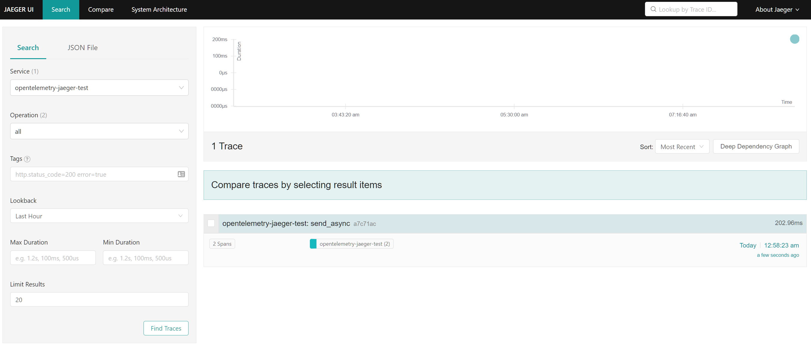
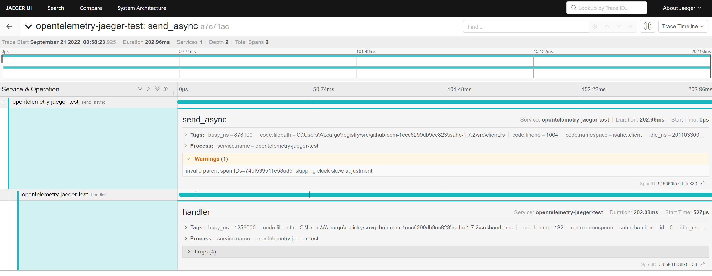

# rust-opentelemetry-jaeger-test

A small reproduction of an issue with submitted spans to Jaeger. Note that the issue does not appear 100% of the time, but it does appear most of the time. There is [a possibly-related Hyper issue](https://github.com/hyperium/hyper/pull/2261), though that presumably wouldn’t account for surf or isahc’s behaviour.

## Testing procedure

1. Clone this repository.
2. Start Jaeger via Docker: <kbd>docker run -it --rm -p 6831:6831/udp -p 6832:6832/udp -p 16686:16686 jaegertracing/all-in-one:1.38</kbd>.
3. Run the application: <kbd>cargo run -- --log 'debug,rust_opentelemetry_jaeger_test=trace' --backend surf --jaeger-agent-endpoint 127.0.0.1:6831</kbd>.
4. Go to [localhost:16686](http://localhost:16686), select the `opentelemetry_jaeger_test` service from the dropdown on the left, and click on Find Traces.
5. For more examples, repeat step 3 with <kbd>--backend reqwest</kbd> or <kbd>--backend isahc</kbd> and check Jaeger again.

Add <kbd>--json</kbd> to the application’s command line to see the details of span creation and closure.

## Expected results

Properly nested spans from all the components involved.

## Actual results

Dropped spans, scattered traces, and flattened hierarchies. For example, running with the isahc backend creates a trace with only two spans:

